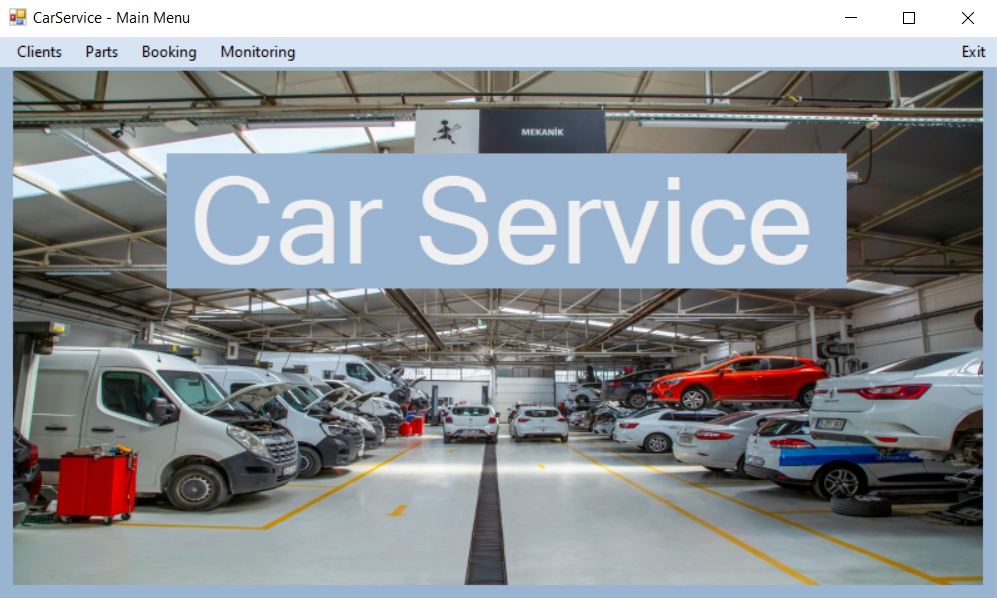
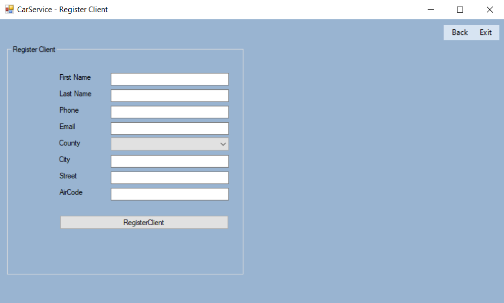
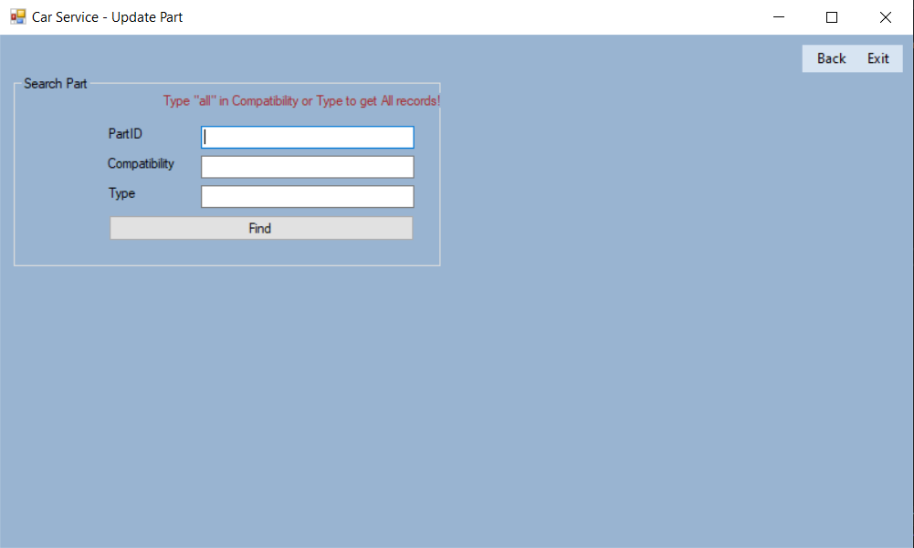

# carservice-sys-c-sharp


```
Car Service system is a software created for digitalization and acceleration of car repair service. The software provides the functions of a complete workflow: adding, updating and deleting a customer account, spare parts and appointments; calculating cost, making payments and creating an annual report.

Creating a client account requires client to provide contact information. Once the account is created, the manager can use the client's last name to realise most of the software functions.
```

> **The project is part of a university project and has been created for educational purposes only.**

---

| Feature                    | Description                                                        |
| -------------------------- | ------------------------------------------------------------------ |
| 👤 Client Management       | Create, update, and delete client records                          |
| 🧩 Parts Management        | Add, update, and remove parts used in repairs                      |
| 📅 Appointment Scheduling  | Schedule appointments based on available time slots                |
| ❌ Appointment Cancellation | Cancel existing appointments when necessary                        |
| 💰 Cost Calculation        | Automatically calculate total service cost based on selected parts |
| 🛡 Basic Data Validation        | Basic input data validation involved |
| 🔄 Workflow Automation     | Simplifies daily operations for auto mechanic services             |
| 🔗 Entity Integration      | Coordinates clients, parts, and appointments into a unified system |

---

## 📸 Screenshots

| Main Menu |
|:--------:|
|  |

| Register Client |
|:--------:|
|  |

| Update Part info |
|:--------:|
|  |

---

### ⬇️ Installation

```bash
git clone https://github.com/Albert-Tr-pp/CarService-Sys-c-sharp.git
cd CarService-Sys-c-sharp/CarService

start CarService.sln
```

---

## 📁 Project Structure

```
Quiz-Game_js/
├── CarService/
│   ├── .vs/...
│   ├── CarService/...
│   ├── packages/...
│   ├── CarService.sln
│   ├── image_1
│   └── image_2
├── screenshots/...
├── .gitignore
├── carservice.sql
├── LICENCE
└── README.md
```

> ❗❗❗ Requirements Specification document will be added soon.

---

## ⚠️ License Notice

MIT License

Copyright (c) 2025 Albert Tromsa

---

## 📬 Contact

Feel free to reach out for questions or suggestions:

- Gmail: [tromsaalbert@gmail.com](mailto:tromsaalbert@gmail.com)
- GitHub: [github.com/Albert-Tr-pp](https://github.com/Albert-Tr-pp)

---

> 🧪 Keep learning by building! This project is a great foundation to explore Godot and game development.